# agentes-software — Plantilla para desarrollar software con agentes de IA

Estructura base para trabajar con un agente de IA (Claude Code, Codex, Cursor…)
de forma **segura y estructurada** en proyectos de software. No es un proyecto en
sí: es una plantilla que copias a tu proyecto real. El agente la sigue paso a
paso, con una **compuerta humana entre cada fase**, antes de escribir la primera
línea de código.

## Cómo usarla

1. Copia el contenido de este repo a tu nuevo proyecto.
2. Verifica que **git esté configurado**. Se hace un commit por fase/incremento.
3. **Deja primero tus entradas.** Documentos de contexto (antecedentes, specs,
   notas) en `material/`; artefactos analíticos (notebooks, datos de entrada/salida,
   resultados previos) en `analisis/`. `material/` es **obligatorio**: necesita al
   menos un archivo para arrancar —si no tienes documentos, escribe un brief breve—,
   porque el encuadre se **deriva del material**, no de lo que alcances a teclear en
   frío. `analisis/` es opcional, pero el agente siempre la revisa.
4. Pídele al agente que ejecute `docs/arranque.md`. Ese guion **empieza ingiriendo
   tus entradas**: inventaría lo que hay, te pregunta si está completo, te propone a
   dónde va cada cosa (gate) y arma un borrador de `docs/contexto.md`. Recién después
   viene el encuadre, que es **revisar y completar** ese borrador —no llenarlo desde
   cero—, seguido del diseño y la validación. Hay un gate en cada paso, **antes de
   programar**.

## Las 5 fases (con compuerta humana entre cada una)

1. **Encuadre** — contexto, objetivos, no-objetivos, criterios de éxito, set de
   oro, stack y arquitectura, modelo de despliegue (`docs/contexto.md`).
2. **Diseño / plan** — enfoque mínimo e incrementos (`docs/plan.md`). Antes del gate,
   el encuadre y el plan pasan una **revisión funcional independiente** que verifica
   completitud y consistencia contra el material (reporta, no escribe).
3. **Ejecución iterativa** — incrementos pequeños, verificados sobre datos reales,
   con revisión crítica independiente antes de cada commit.
4. **Validación** — `docs/definicion-de-hecho.md`.
5. **Cierre y aprendizaje** — lecciones a `MEMORIA.md`.

## Diagrama de la metodología

El flujo completo: el **arranque** (antes de programar, con `material/` como
precondición y un gate por paso) y el **ciclo de vida** (la Fase 3 es un bucle que se
cierra con el juez y la Definición de Hecho). Las dos revisiones independientes —el
**revisor funcional** sobre el encuadre y el **juez** sobre el código— son los puntos
donde otro contexto verifica el trabajo.

```mermaid
flowchart TD
    Start(["El agente abre AGENTS.md y ejecuta docs/arranque.md"]) --> Pre

    subgraph ARR["ARRANQUE · antes de la primera linea de codigo"]
      direction TB
      Pre{"¿material/ tiene 1+ archivo real?<br/>precondicion dura"}
      Pre -->|No| StopMat["Detente y pide material<br/>documento o brief breve"]
      StopMat -.-> Pre
      Pre -->|Si| P1["Paso 1 · Ingesta<br/>inventariar material/ y analisis/<br/>clasificar y rutear, sembrar docs vivos<br/>muestrear 1-3 insumos reales"]
      P1 --> G1{"Gate: ¿set de entrada completo<br/>y ruteo aprobado?"}
      G1 -->|No| P1
      G1 -->|Si| P2["Paso 2 · Encuadre<br/>revisar y completar el borrador de contexto.md<br/>marcar origen: del material / inferido / FALTA<br/>set de oro con ejemplo entrada a salida"]
      P2 --> G2{"Gate: ¿encuadre confirmado,<br/>sin FALTA ni inferido pendiente?"}
      G2 -->|No| P2
      G2 -->|Si| P3["Paso 3 · Diseño<br/>plan minimo e incrementos en plan.md<br/>fuera de alcance explicito"]
      P3 --> P4["Paso 4 · Revision funcional independiente<br/>revisor funcional: contexto y plan vs material/analisis<br/>reporta, no escribe"]
      P4 --> RF{"¿Veredicto PASA y<br/>sin vacios R-E.n abiertos?"}
      RF -->|"Falla: vacio"| Fill["La persona llena el hueco:<br/>escribe en el .md o agrega documento"]
      Fill --> P4
      RF -->|Pasa| P5["Paso 5 · Registro<br/>decisiones como ADR en decisiones.md"]
      P5 --> GD{"Gate de diseño:<br/>¿la persona aprueba el plan?"}
      GD -->|No| P3
    end

    GD -->|Si| EXEC

    subgraph CICLO["CICLO DE VIDA · Fase 3 en adelante"]
      direction TB
      EXEC["Fase 3 · Ejecucion iterativa<br/>un incremento pequeño y revisable"]
      EXEC --> Vreal["Verificacion sobre datos reales<br/>no solo fixtures sinteticos"]
      Vreal --> Judge["Juez de codigo · revision-critica<br/>revision critica independiente<br/>hallazgos R-I#.n"]
      Judge --> JV{"¿PASA?"}
      JV -->|Bloqueantes| FixB["Resolver subtareas<br/>commit Cierra: R-I#.n"]
      FixB --> Judge
      JV -->|Si| DoD{"¿Cumple la Definicion de Hecho?"}
      DoD -->|No| EXEC
      DoD -->|Si| Commit["Commit enlazado Ref: / Cierra:<br/>plan y trazabilidad al dia"]
      Commit --> More{"¿Quedan criterios C#<br/>sin verificar?"}
      More -->|Si| EXEC
      More -->|No| F4["Fase 4 · Validacion<br/>Definicion de Hecho del conjunto"]
      F4 --> F5["Fase 5 · Cierre y aprendizaje<br/>lecciones a MEMORIA.md, luego skills"]
    end

    F5 --> End(["Fin"])
```



## Los mecanismos que la sostienen

- **Compuertas (gates):** tú apruebas explícitamente entre fases. No se avanza sin
  tu OK.
- **Registro de decisiones:** toda decisión con más de una opción razonable queda
  en `docs/decisiones.md` (ADR-lite). Trazabilidad y aprendizaje.
- **Guardas anti-sobredimensionamiento:** complejidad solo cuando se necesita.
  Riesgo típico en software: abstracción prematura y dependencias especulativas.
- **Ciclo de aprendizaje:** `corrección → MEMORIA.md → (si se repite) → skill`.

## Portabilidad: AGENTS.md es el núcleo

`AGENTS.md` contiene todas las instrucciones del proyecto; es la **fuente de
verdad** y el estándar que leen las distintas herramientas. `CLAUDE.md` solo lo
importa (`@AGENTS.md`) más notas propias de Claude Code. Si cambias de
herramienta, te llevas `AGENTS.md` y funciona.

> Una regla en `AGENTS.md` moldea el comportamiento del agente pero no lo
> garantiza. Lo que no puede fallar (tests obligatorios, escaneos) va en
> CI / pre-commit / hooks.

## Estructura

```
.
├── AGENTS.md            instrucciones del proyecto (canónico)
├── CLAUDE.md            importa AGENTS.md + notas de Claude Code
├── README.md            este archivo
├── MEMORIA.md           lecciones del proyecto
├── docs/
│   ├── arranque.md          guion de arranque (primer punto de entrada)
│   ├── contexto.md          encuadre + set de oro + stack/arquitectura
│   ├── plan.md              plan vivo + bitácora + backlog
│   ├── trazabilidad.md      hilo criterios ↔ incrementos ↔ hallazgos
│   ├── decisiones.md        ADR-lite
│   ├── convenciones.md      cómo hacemos las cosas aquí
│   └── definicion-de-hecho.md
├── material/            entrada obligatoria: documentos de contexto (se leen)
├── analisis/            entrada opcional: artefactos analíticos (notebooks, datos)
├── skills/              procedimientos reutilizables (revisión funcional y crítica)
├── .env.example         variables de entorno documentadas (sin valores)
└── .gitignore
```

---

> **Al iniciar tu proyecto real**, reemplaza el contenido de arriba por el README
> de tu proyecto: descripción, estructura, entradas/salidas y cómo ejecutarlo. Lo
> sustantivo (objetivos, criterios, stack) vive en `docs/contexto.md`.
